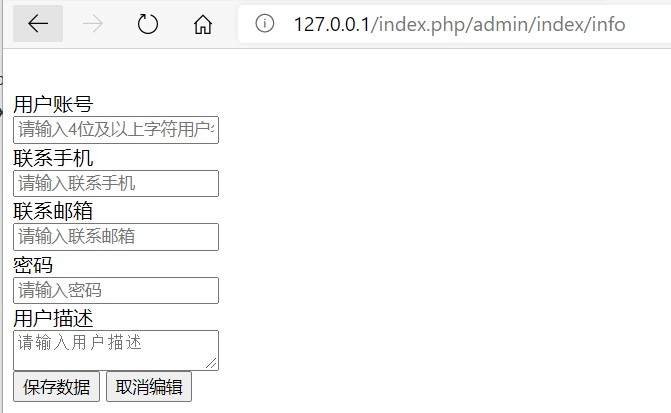
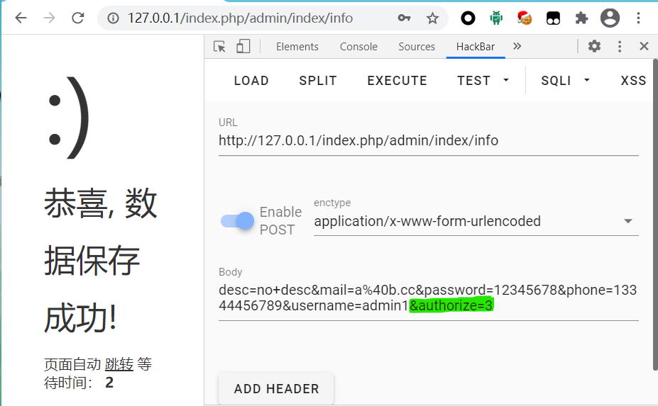

# Web题：web_faka

## 0x00. 漏洞成因

使用RIPS代码审计工具，在结果中找到一下代码片段（文件路径`web_faka/html/application/manage/controller/Backup.php`）:

```php
133:    function downloadBak() {
134:        $file_name = $_GET['file'];
135:        $file_dir = $this->config['path'];
136:        if (!file_exists($file_dir . "/" . $file_name)) { //检查文件是否存在
137:            return false;
138:            exit;
139:        } else {
140:            $file = fopen($file_dir . "/" . $file_name, "r"); // 打开文件
141:            // 输入文件标签
142:            header('Content-Encoding: none');
143:            header("Content-type: application/octet-stream");
144:            header("Accept-Ranges: bytes");
145:            header("Accept-Length: " . filesize($file_dir . "/" . $file_name));
146:            header('Content-Transfer-Encoding: binary');
147:            header("Content-Disposition: attachment; filename=" . $file_name);  //以真实文件名提供给浏览器下载
148:            header('Pragma: no-cache');
149:            header('Expires: 0');
150:            //输出文件内容
151:            echo fread($file, filesize($file_dir . "/" . $file_name));
152:            fclose($file);
153:            exit;
154:        }
155:    }
```

`$file_name`变量来自于`$_GET['file']`，整个过程未过滤，可控。

直接访问`http://faka.web/index.php/manage/Backup`却跳转到登录页面。

> 再看该函数和该类的父类，没有鉴权跳转相关语句呀？事后才找到在`web_faka/html/extend/hook/AccessAuth.php`里有写，数据库的`SystemNode`表中记录的路径都会鉴权。

去看`tk.sql`文件，里面记录了admin密码，但是是MD5加密的。尝试几个弱口令失败。

重新审视题目代码。

在`web_faka/html/application/admin/controller/Index.php`中只有`public function index()`这个函数里有鉴权代码，尝试访问该文件其他函数，可以发现访问。其中`info`函数可以添加管理员：

`http://127.0.0.1/index.php/admin/index/info`



填写提交后即可登录。

再次尝试访问`manage/Backup`，发现提示权限不足。

寻找`$this->_form('SystemUser', 'user/form')`函数的定义，该函数在父类即BasicAdmin中，文件路径`web_faka/html/extend/controller/BasicAdmin.php`。

```php
46:    /**
47:     * 表单默认操作
48:     * @param Query $dbQuery 数据库查询对象
49:     * @param string $tplFile 显示模板名字
50:     * @param string $pkField 更新主键规则
51:     * @param array $where 查询规则
52:     * @param array $extendData 扩展数据
53:     * @return array|string
54:     */
55:    protected function _form($dbQuery = null, $tplFile = '', $pkField = '', $where = [], $extendData = [])
56:    {
57:        $db = is_null($dbQuery) ? Db::name($this->table) : (is_string($dbQuery) ? Db::name($dbQuery) : $dbQuery);
58:        $pk = empty($pkField) ? ($db->getPk() ? $db->getPk() : 'id') : $pkField;
59:        $pkValue = $this->request->request($pk, isset($where[$pk]) ? $where[$pk] : (isset($extendData[$pk]) ? $extendData[$pk] : null));
60:        // 非POST请求, 获取数据并显示表单页面
61:        if (!$this->request->isPost()) {
62:            $vo = ($pkValue !== null) ? array_merge((array)$db->where($pk, $pkValue)->where($where)->find(), $extendData) : $extendData;
63:            if (false !== $this->_callback('_form_filter', $vo)) {
64:                empty($this->title) || $this->assign('title', $this->title);
65:                return $this->fetch($tplFile, ['vo' => $vo]);
66:            }
67:            return $vo;
68:        }
69:        // POST请求, 数据自动存库
70:        $data = array_merge($this->request->post(), $extendData);
71:        if(isset($data['password'])){
72:            if( !empty($data['password'])) {
73:                $data['password'] = md5($data['password']);
74:            }else{
75:                unset($data['password']);
76:            }
77:        }
78:        if (false !== $this->_callback('_form_filter', $data)) {
79:            $result = DataService::save($db, $data, $pk, $where);
80:            if (false !== $this->_callback('_form_result', $result)) {
81:                if ($result !== false) {
82:                    $this->success('恭喜, 数据保存成功!', '');
83:                }
84:                $this->error('数据保存失败, 请稍候再试!');
85:            }
86:        }
87:    }
```

调用时有两个参数，`SystemUser`和`user/form`。第二个参数是模板，我们去寻找模板`user/form`。我们找到路径`web_faka/html/application/templates/pc/admin/default/user/form.html`。代码如下：

```html
<form class="layui-form layui-box" style='padding:25px 30px 20px 0' action="__SELF__" data-auto="true" method="post">

    <div class="layui-form-item">
        <label class="layui-form-label">用户账号</label>
        <div class="layui-input-block">
            {if $vo and isset($vo.username)}
            <input readonly="readonly" disabled="disabled" name="username" value='{$vo.username|default=""}'
                   required="required" title="请输入用户名称" placeholder="请输入用户名称" class="layui-input layui-disabled">
            {else}
            <input name="username" value='{$vo.username|default=""}' required="required" pattern="^.{4,}$"
                   title="请输入用户名称" placeholder="请输入4位及以上字符用户名称" class="layui-input">
            {/if}
        </div>
    </div>

    <div class="layui-form-item">
        <label class="layui-form-label">联系手机</label>
        <div class="layui-input-block">
            <input type="tel" autofocus name="phone" value='{$vo.phone|default=""}' pattern="^1[3-9][0-9]{9}$"
                   title="请输入联系手机" placeholder="请输入联系手机" class="layui-input">
        </div>
    </div>

    <div class="layui-form-item">
        <label class="layui-form-label">联系邮箱</label>
        <div class="layui-input-block">
            <input name="mail" pattern="^([a-zA-Z0-9_\.\-])+\@(([a-zA-Z0-9\-])+\.)+([a-zA-Z0-9]{2,4})+$"
                   value='{$vo.mail|default=""}' title="请输入联系邮箱" placeholder="请输入联系邮箱" class="layui-input">
        </div>
    </div>

    <div class="layui-form-item">
        <label class="layui-form-label">密码</label>
        <div class="layui-input-block">
            <input name="password" type="password"
                   value='' title="请输入密码" placeholder="请输入密码" class="layui-input">
        </div>
    </div>

    {if isset($authorizes)}
    <div class="layui-form-item">
        <label class="layui-form-label">访问授权</label>
        <div class="layui-input-block">
            {foreach $authorizes as $authorize}
            {if in_array($authorize['id'],$vo['authorize'])}
            <label class="think-checkbox">
                <input type="checkbox" checked name="authorize[]" value="{$authorize.id}" lay-ignore> {$authorize.title}
            </label>
            {else}
            <label class="think-checkbox">
                <input type="checkbox" name="authorize[]" value="{$authorize.id}" lay-ignore> {$authorize.title}
            </label>
            {/if}
            {/foreach}
            {if empty($authorizes)}
            <span class="color-desc" style="line-height:36px">未配置权限</span>
            {/if}
        </div>
    </div>
    {/if}

    <div class="layui-form-item">
        <label class="layui-form-label">用户描述</label>
        <div class="layui-input-block">
            <textarea placeholder="请输入用户描述" title="请输入用户描述" class="layui-textarea"
                      name="desc">{$vo.desc|default=""}</textarea>
        </div>
    </div>

    <div class="hr-line-dashed"></div>

    <div class="layui-form-item text-center">
        {if isset($vo['id'])}<input type='hidden' value='{$vo.id}' name='id'/>{/if}
        <button class="layui-btn" type='submit'>保存数据</button>
        <button class="layui-btn layui-btn-danger" type='button' data-confirm="确定要取消编辑吗？" data-close>取消编辑</button>
    </div>
    <script>window.form.render();</script>
</form>

```

在`line40~60`判断了`authorizes`数组变量。查看`tk.sql`，发现`system_user`表中admin用户有`authorize`字段，值为`3`。我们将表单提交的`authorize`数组设为数组`[3]`，即提交POST的请求体加上`authorize[]=3`，发现还是无效果……搞错了，再来！

重新看代码，`BasicAdmin.php`中，`line70`将POST请求体追加`$extendData`，然后赋值给`$data`，后面`line79`将`data`写入数据库。所以，POST请求体直接加上`authorize=3`即可。



登录后再次尝试访问`manage/Backup`有权限了。

回到最初用RIPS找到漏洞的那段代码，见本文第一块代码块，传入GET参数名`file`的值使用`../`向上跳转，多次尝试可以跳转到根目录，构造如下GET请求即可下载到flag：

`http://faka.web/index.php/manage/backup/downloadBak?file=../../../../tmp/flag`


## 0x01. 漏洞修复

1. 修复任意文件下载：过滤路径分隔符，过滤`..`，注意要全局过滤，不能因只过滤一次而导致`....`变成`..`。
2. 将所有管理员功能都加入鉴权，添加路径到数据库`system_node`表就行了。

