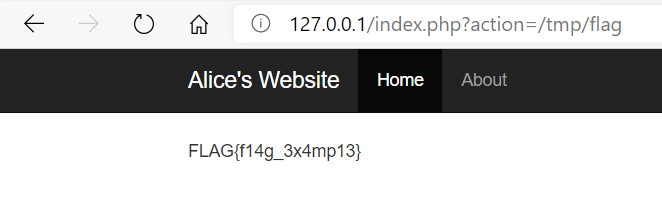

# Web题：AliceWebsite

## 0x00. 漏洞成因

`index.php`页面`line29:36`部分代码如下：

```
29:        <?php
30:        $action = (isset($_GET['action']) ? $_GET['action'] : 'home.php');
31:        if (file_exists($action)) {
32:            include $action;
33:        } else {
34:            echo "File not found!";
35:        }
36:        ?>
```

`line32`为包含语句，被包含的文件名作为参数`$action`传入。向上看发现`$action`从HTTP的GET请求参数`$_GET`获取后没有任何处理。显然此处形本地文件包含漏洞。

> LFI, Local File Include的简称，意为本地文件包含。

直接将flag的物理路径作为`action`参数传入即可显示结果。

`http://acice.website:port/index.php?action=/tmp/flag`



## 0x01. 漏洞修补

修补本地文件包含，过滤伪协议、冒号、上层目录跳转等符号。